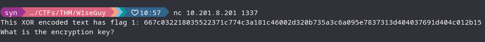
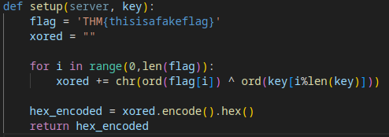
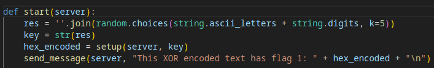
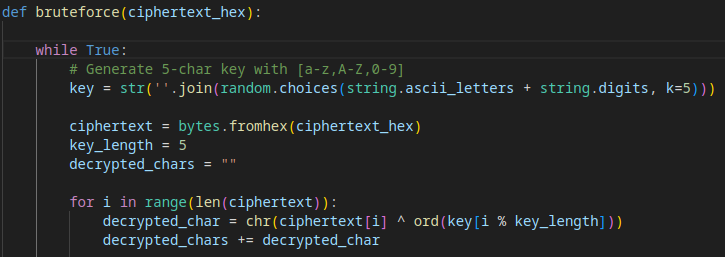
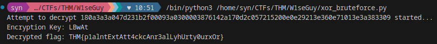
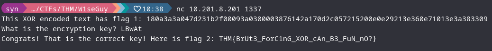

# **W1seGuy**
**Completed 11/12/2025**

https://tryhackme.com/room/w1seguy

**Devices:**
- My PC: 10.13.47.167
- W1seGuy VM: 10.201.8.201

**Flags:**
1. THM{p1alntExtAtt4ckcAnr3alLyhUrty0urxOr}
2. THM{BrUt3_ForC1nG_XOR_cAn_B3_FuN_nO?}

# Initial Investigation
## Connecting to the server
We are told to connect with `nc 10.201.8.201 1337` to begin the challenge. This reveals a simple prompt that includes some XOR-encrypted ciphertext.


## Source Code
We're given the Python source code of the server running the challenge

- Dummy flag is XOR encrypted with some key and encoded as hex
- Key length is shorter than the ciphertext length (modulo to loop back over the key)


- The key is randomly generated using the characters a-z, A-Z, 0-9
- The length of the key is 5 characters

# Cracking the XOR (Full code at bottom of page)

- Writing a simple Python script to perform the same operation, but bruteforcing every possible 5-character key was my immediate idea.
- I'm aware this is a relatively inefficient approach as it relies on random generation without any checks for repeated keys, but a keyspace this small with a modern CPU means it's still crackable like this.


- I realized that a simple crib could be used to drastically speed up the cracking process.
- We know the THM flag format is "THM{flag}"
- Check if the decrypted text starts with "THM{" by iteration 4
- Continue decryption if so, otherwise skip to the next attempt
- Check if the decrypted text ends with "}"
- Output the key and decrypted flag if all conditions are met

# **Flag 1**

- Running my program, even with the inefficient duplicate key generation, output the key and the first flag within a minute.
- Entering the flag into the THM page confirmed that it was correct.

# **Flag 2**

- Entering the encryption key into the server reveals flag 2, which can then be entered in THM.

# **Lessons Learned**
- Short encryption keys with small character sets are trivial to bruteforce, even in a relatively inefficient manner.
- Using a crib (piece of known plaintext) in a bruteforce attack can speed up the cracking process drastically
- Practice reading source code and understanding/reversing basic encryption algorithms

# Bruteforce Code
```python
import random
import string

encrypted = "200c754e114525545b15313c4c741500705b5e02352a4a06001808415d340630410514063c77471c"

def bruteforce(ciphertext_hex):

    while True:
        # Generate 5-char key with [a-z,A-Z,0-9]
        # Inefficient due to no checks for duplicate random keys, but still pretty fast due to small key space with a fast CPU
        key = str(''.join(random.choices(string.ascii_letters + string.digits, k=5)))

        ciphertext = bytes.fromhex(ciphertext_hex)
        key_length = 5
        decrypted_chars = ""

        for i in range(len(ciphertext)):
            decrypted_char = chr(ciphertext[i] ^ ord(key[i % key_length]))
            decrypted_chars += decrypted_char

            # "THM{" crib check
            if i == 3 and decrypted_chars != "THM{":
                break
        
        # Check if crib and last character are correct for flag format
        if decrypted_chars.startswith("THM{") and decrypted_chars.endswith("}"):
            print("Encryption Key: ", key)
            break

    return ''.join(decrypted_chars)
    
if __name__ == "__main__":
    flag = bruteforce(encrypted)
    print("Decrypted flag: ", flag)
```